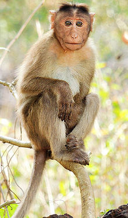

## Vocalization Classifier for Macaque 'coo' calls.

## Citation : 
Fukushima, Makoto et al. (2015), Data from: Distributed acoustic cues for caller identity in macaque vocalization, Dryad, Dataset, https://doi.org/10.5061/dryad.7f4p9

**Aim** : This project aims to demonstrate the efficacy of using fastai's easy to use software library to build deep learning models for seemingly complex problems.

**Summary** : The project builds a deep learning model to classify the distinct 'coo' calls or vocalizations of eight distinct macaques. The vocalizations are stored in the 'wav' format, however the classification process is done on the spectograms (images). This allows me to train a powerful ImageNet model - resnet34 - for a seemingly unrelated problem, that of sound classification.

The dataset used in this project is available here : https://datadryad.org/stash/dataset/doi:10.5061/dryad.7f4p9

The study that was conducted on this dataset can be found here : https://royalsocietypublishing.org/doi/10.1098/rsos.150432

The table (taken from the study) below, lists the eight monkeys using a two-letter alphabetical code, which was also used in this project.

This study used a linear classifier to achieve a final 'mean classification performance' of 92%.

**Result** : This model is able to achieve around 97-98% classification accuracy on the validation set with nearly equal training and validation losses, beating the linear classifier used in the study handily.   

## The Spectograms

## The Confusion Matrix

## Final Accuracy : 97.735%

